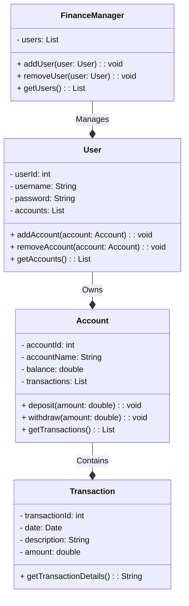

# GerenciamentoFinancasPessoaisApiRestFulJava
Sistema de Gerenciamento de Finanças Pessoais: Aplicativo que ajude os usuários a controlar suas finanças pessoais. Isso pode incluir rastreamento de despesas, categorização de transações e geração de relatórios.

# Diagrama de classe 

