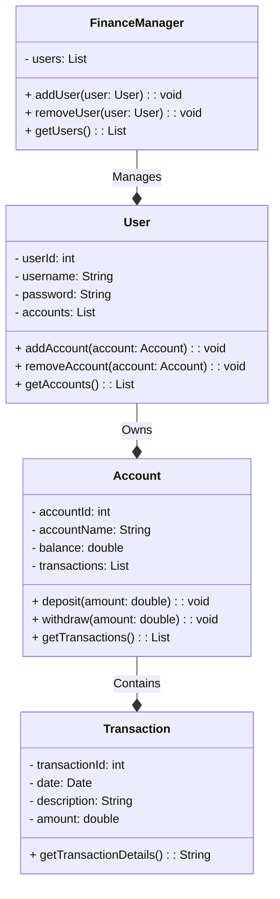

# GerenciamentoFinancasPessoaisApiRestFulJava
Sistema de Gerenciamento de Finanças Pessoais: Aplicativo que ajude os usuários a controlar suas finanças pessoais. Isso pode incluir rastreamento de despesas, categorização de transações e geração de relatórios.

# Finanças Pessoais

Um aplicativo de finanças pessoais para controlar seus gastos e orçamento.

## Descrição

O aplicativo de Finanças Pessoais é uma ferramenta de gerenciamento financeiro que permite aos usuários acompanhar suas despesas, criar orçamentos e obter insights sobre seus hábitos de gastos.

## Funcionalidades

- Registro de despesas com categorias personalizadas.
- Criação de orçamentos mensais.
- Relatórios de despesas e orçamentos.
- Gráficos para visualização de dados financeiros.
- Configurações de notificação para lembretes de despesas pendentes.

## Pré-requisitos

- Java JDK 11
- Maven
- Banco de Dados (por exemplo, MySQL)

## Como Rodar

Siga as etapas abaixo para configurar e executar o aplicativo:

# Diagrama de classe 

